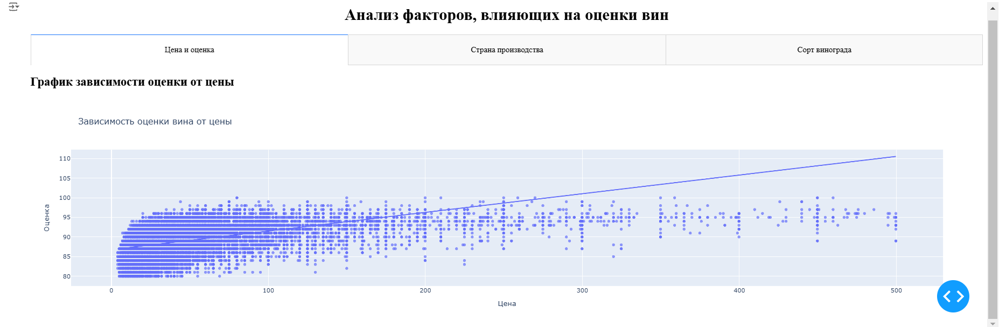
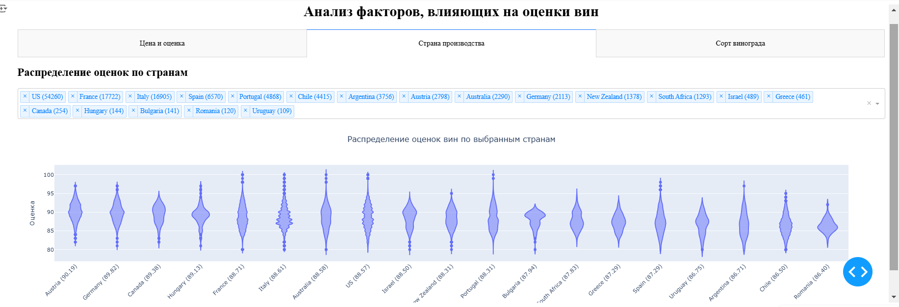
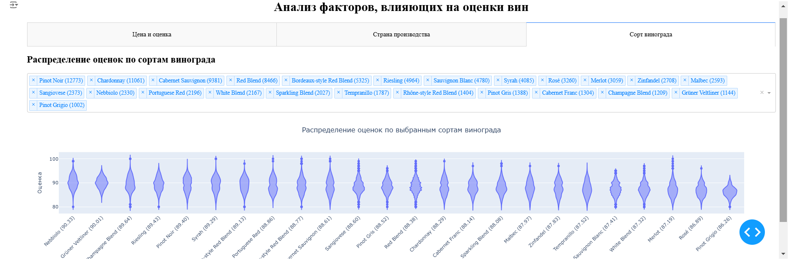

# Анализ факторов, влияющих на оценки вин

## Описание проекта

**Цель проекта** — выявить, как различные характеристики вина (страна производства, регион, сорт винограда, цена и т.д.) влияют на его оценку.

**Гипотезы:**
- **Цена напрямую влияет на оценку вина**: чем выше цена вина, тем выше его оценка.
- **Страна производства имеет значение**: вина из Франции получают более высокие оценки, чем вина из других стран.
- **Оценка вина зависит от сорта винограда**: некоторые сорта винограда чаще получают более высокие оценки.

В проекте использовался датасет [Wine Reviews](https://www.kaggle.com/datasets/zynicide/wine-reviews) с платформы Kaggle. Датасет содержит информацию о различных винах, включая их оценки, цену, страну производства, сорт винограда и другие характеристики.

## Анализ и результаты

### Гипотеза 1: Цена напрямую влияет на оценку вина

- **Цель:** Проверить, существует ли зависимость между ценой вина и его оценкой.
- **Методы:**
  - Построение диаграммы рассеяния с линией тренда.
  - Расчет коэффициента корреляции Пирсона.
  - Построение линейной регрессионной модели.
- **Результаты:**
  - Коэффициент корреляции Пирсона: **0.4956**, что указывает на умеренную положительную связь.
  - Линейная регрессия показала, что цена статистически значимо влияет на оценку, но объясняет только ~24.56% вариации оценок.
- **Вывод:** Цена оказывает влияние на оценку вина, но не является основным фактором, определяющим качество.

### Гипотеза 2: Страна производства имеет значение

- **Цель:** Определить, влияет ли страна производства на оценку вина.
- **Методы:**
  - Построение скрипичных диаграмм для распределения оценок по странам.
  - Проведение однофакторного дисперсионного анализа (ANOVA).
- **Результаты:**
  - ANOVA-тест показал статистически значимые различия между средними оценками вин из разных стран (F-статистика: **343.1409**, p-value ≈ 0).
- **Вывод:** Страна производства значимо влияет на оценку вина.

### Гипотеза 3: Оценка вина зависит от сорта винограда

- **Цель:** Проверить, влияет ли сорт винограда на оценку вина.
- **Методы:**
  - Построение скрипичных диаграмм для распределения оценок по сортам винограда.
  - Проведение однофакторного дисперсионного анализа (ANOVA).
- **Результаты:**
  - ANOVA-тест подтвердил статистически значимые различия между средними оценками различных сортов винограда (F-статистика: **306.0571**, p-value ≈ 0).
- **Вывод:** Сорт винограда оказывает влияние на оценку вина.

## Дашборд

Интерактивный дашборд создан с использованием **Dash** и позволяет пользователям:

- **Вкладка "Цена и оценка":** Исследовать зависимость оценки вина от цены с возможностью просмотра линии тренда и детальной информации о точках данных.

- **Вкладка "Страна производства":** Выбирать интересующие страны и анализировать распределение оценок вин из этих стран.

- **Вкладка "Сорт винограда":** Выбирать различные сорта винограда и сравнивать их по средним оценкам и распределению оценок.

## Выводы

В ходе исследования были проверены три гипотезы, связанные с факторами, влияющими на оценку вин. Основные выводы:

Цена оказывает влияние на оценку, но его сила невелика. Это подтверждается низким значением $R^2$ линейной регрессии.
Страна производства значимо влияет на оценку вина. Различия между странами статистически значимы, и некоторые страны (например, Австрия и Германия) стабильно получают высокие оценки.
Сорт винограда также оказывает влияние на оценку. ANOVA-тест показал, что между сортами существуют значительные различия в средних оценках.
Рекомендации:

Потребители могут использовать результаты анализа для выбора вина, учитывая страну производства и сорт винограда.
Производителям стоит уделить внимание популярным и высоко оцениваемым сортам винограда, а также странам, которые ассоциируются с высоким качеством.
